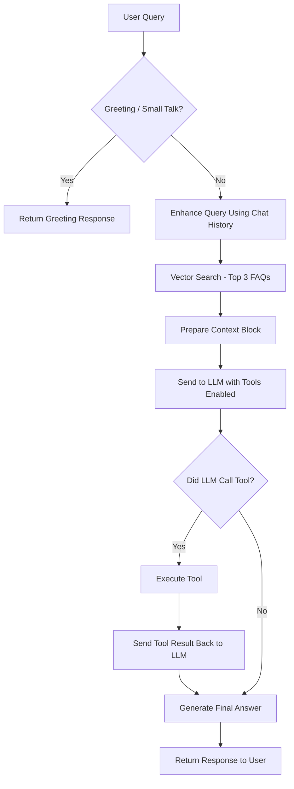

# Complete System Simplification and Vector Store Restructuring

## Overview

This plan simplifies the system from a complex microservice-like architecture to a simple RAG + Tools approach, and restructures the vector store from 160 Markdown files to a single JSON file.

## Current State Analysis

- **160 Markdown files** in `docs/faq/` directory
- **Complex architecture**: Intent Router, Slot Manager, Query Optimizer, Context Tracker, Pricing Handler, Capacity Handler, Recommendation Engine, 3 synthesis strategies, validation layers, confidence scoring
- **Query flow**: 10+ processing steps before generating response

## Target State

- **Single JSON file** with all FAQs
- **Simple architecture**: User → LLM (with tools) → Simple RAG → Response
- **One embedding per FAQ** (unless FAQ > 1000 words, then split)
- **Tools for**: Pricing calculations, Capacity checks
- **Simplified query flow**: Query → RAG retrieval → LLM with tools → Response

---

## Phase 1: Vector Store Restructuring

### 1.1 Create JSON Export Script

**File**: `chatbot/scripts/export_faqs_to_json.py`

**Source**: Read from Excel file `/home/ilsa/swiss-cottage-ai-assit/Swiss Cottages FAQS.xlsx`

**Implementation**:

- Use `extract_faq_from_excel()` function from `chatbot/scripts/enrich_faq_metadata.py` as base
- Extract Q&A pairs with metadata (id, category, question, answer)
- Extract links from resource_links mapping: Use `get_resource_links()` from `chatbot/pdf_faq_extractor.py` to get FAQ-number-based links
- Also extract links from existing Markdown files if they exist (from "## Useful Links" section)
- Merge links from both sources (resource_links mapping + Markdown)
- Calculate word counts for each FAQ
- Export to single JSON file: `docs/faqs.json`

**JSON Structure**:

```json
{
  "faqs": [
    {
      "id": "faq_001",
      "category": "General & About",
      "question": "What is...",
      "answer": "...",
      "links": [
        {
          "name": "Website",
          "url": "https://swisscottagesbhurban.com/"
        },
        {
          "name": "Instagram",
          "url": "https://www.instagram.com/swiss_cottages_bhurban/"
        }
      ],
      "word_count": 150,
      "should_split": false,
      "tags": [],
      "priority": 1
    }
  ]
}
```

**Link Extraction Logic**:

1. **From resource_links mapping**: Use `get_resource_links()` from `chatbot/pdf_faq_extractor.py` to get FAQ-number-based links
2. **From Markdown files**: Parse "## Useful Links" section to extract multiple links (if files exist)
3. **Merge**: Combine both sources, deduplicate by URL, preserve all link names

**Key Functions to Reuse**:

- `extract_faq_from_excel()` from `enrich_faq_metadata.py` - Excel extraction (but skip intent/slots extraction)
- `get_resource_links()` from `chatbot/pdf_faq_extractor.py` - Resource link mapping
- Parse markdown files to extract "## Useful Links" section if files exist

**Note**: Do NOT extract `link`, `account_resource`, `intent`, `required_slots`, or `optional_slots` - these are not needed with the simplified tools-based approach

### 1.2 Create New Vector Store Builder

**File**: `chatbot/scripts/build_vector_store_from_json.py`

- Load `docs/faqs.json`
- For each FAQ:
                                - If `word_count > 1000`: Split into chunks (keep existing splitter logic)
                                - If `word_count <= 1000`: Keep as single embedding
- Format text for embedding:
  ```
  FAQ #{id} - {category}
  
  Question: {question}
  
  Answer: {answer}
  
  Useful Links:
 - [Link Name 1](url1)
 - [Link Name 2](url2)
  ```


**Note**: Include links in the embedding text so they're available in RAG context

- Store in ChromaDB with metadata:
  ```python
  metadatas=[{
      "id": faq["id"],
      "category": faq["category"],
      "question": faq["question"],
      "tags": faq.get("tags", []),
      "priority": faq.get("priority", 1),
      "links": json.dumps(faq.get("links", []))  # Store links as JSON string
  }]
  ```


**Note**: Links are included in both the embedding text (for RAG retrieval) and metadata (for filtering/display)

### 1.3 Update Vector Store Loading

**File**: `chatbot/api/dependencies.py` (function `get_vector_store`)

- Ensure it works with new JSON-based structure
- No changes needed if ChromaDB interface remains same

---

## Phase 2: Architecture Simplification

### 2.1 Remove Complex Components

**Files to remove or deprecate**:

- `chatbot/bot/conversation/intent_router.py` - Replace with simple greeting detection
- `chatbot/bot/conversation/slot_manager.py` - Remove (use LLM tools instead)
- `chatbot/bot/conversation/query_optimizer.py` - Remove (use query directly)
- `chatbot/bot/conversation/context_tracker.py` - Remove (use chat history only)
- `chatbot/bot/conversation/query_complexity.py` - Remove (use single model or simple dual model logic based on `ENABLE_DUAL_MODEL` env var)
- `chatbot/bot/conversation/confidence_scorer.py` - Remove (let LLM express uncertainty)
- `chatbot/bot/conversation/recommendation_engine.py` - Remove or simplify to basic follow-ups
- `chatbot/bot/conversation/ctx_strategy.py` - Keep only simple concatenation strategy

### 2.2 Simplify Synthesis Strategy

**File**: `chatbot/bot/conversation/ctx_strategy.py`

- Remove `TreeSummarizationStrategy` and `AsyncTreeSummarizationStrategy`
- Keep only `CreateAndRefineStrategy` or create even simpler `SimpleConcatenationStrategy`:
                                - Just concatenate retrieved documents with `\n\n`
                                - Pass to LLM with simple prompt

### 2.3 Convert Handlers to Tools

**File**: `chatbot/bot/conversation/tools.py` (NEW)

Create tool definitions and implementations:

**Tool 1: Calculate Pricing**

```python
def calculate_pricing(cottage_id: str, guests: int, nights: int, start_date: str = None) -> str:
    """Calculate pricing for a cottage stay."""
    # Use existing PricingCalculator logic
    # Return JSON string with pricing breakdown
```

**Tool 2: Check Capacity**

```python
def check_capacity(cottage_id: str, guests: int) -> str:
    """Check if a cottage can accommodate the number of guests."""
    # Use existing CottageCapacityMapper logic
    # Return JSON string with capacity info
```

**Tool Config**:

```python
TOOLS_CONFIG = [
    {
        "type": "function",
        "function": {
            "name": "calculate_pricing",
            "description": "Calculate pricing for a cottage stay",
            "parameters": {
                "type": "object",
                "properties": {
                    "cottage_id": {"type": "string", "description": "Cottage number (7, 9, or 11)"},
                    "guests": {"type": "integer", "description": "Number of guests"},
                    "nights": {"type": "integer", "description": "Number of nights"},
                    "start_date": {"type": "string", "description": "Check-in date (optional)"}
                },
                "required": ["cottage_id", "guests", "nights"]
            }
        }
    },
    {
        "type": "function",
        "function": {
            "name": "check_capacity",
            "description": "Check if a cottage can accommodate guests",
            "parameters": {
                "type": "object",
                "properties": {
                    "cottage_id": {"type": "string"},
                    "guests": {"type": "integer"}
                },
                "required": ["cottage_id", "guests"]
            }
        }
    }
]

TOOLS_MAP = {
    "calculate_pricing": calculate_pricing,
    "check_capacity": check_capacity
}
```

### 2.4 Simplify Query Flow

**File**: `chatbot/api/main.py` (functions `chat` and `chat_stream`)

**New Simplified Flow**:



**Implementation Steps**:

1. **Simple Greeting/Small Talk Detection** (replace Intent Router):
   ```python
   def is_greeting_or_small_talk(query: str) -> bool:
       query_lower = query.lower().strip()
       greetings = ["hi", "hello", "hey", "greetings", "good morning", "good afternoon"]
       small_talk = ["thanks", "thank you", "ok", "okay", "yes", "no"]
       return query_lower in greetings or query_lower in small_talk
   ```

2. **Enhance Query Using Chat History** (keep existing `refine_question` function):

                                                - Use chat history to make question standalone and context-aware
                                                - Simple LLM call to enhance query with conversation context

3. **RAG Retrieval**:
   ```python
   retrieved_docs = vector_store.similarity_search(
       query=enhanced_query,
       k=3,  # Top 3 FAQs (as per flowchart)
       filter={"category": category} if category else None  # Optional filtering
   )
   ```

4. **Prepare Context Block**:
   ```python
   context = "\n\n".join([
       f"FAQ #{doc.metadata.get('id', 'unknown')} - {doc.metadata.get('category', '')}\n{doc.page_content}"
       for doc in retrieved_docs
   ])
   ```

5. **Send to LLM with Tools Enabled** (Single Call Approach):
   ```python
   # Build prompt with context
   prompt = f"""
   You are a helpful assistant for Swiss Cottages Bhurban.
   
   Context from FAQs:
   {context}
   
   User Question: {enhanced_query}
   
   Answer the question based on the context above. If you need to calculate pricing or check capacity, use the available tools.
   """
   
   # Model selection based on ENABLE_DUAL_MODEL setting
   import os
   enable_dual = os.getenv("ENABLE_DUAL_MODEL", "false").lower() == "true"
   
   if enable_dual:
       # Option 2: Use fast model first, switch to reasoning if tool is called
       initial_llm = get_fast_llm_client()
   else:
       # Option 1: Use reasoning model for everything
       initial_llm = get_reasoning_llm_client()  # Uses REASONING_MODEL_NAME
   
   # Send to LLM with tools enabled - LLM decides if tool is needed
   response = initial_llm.client.chat.completions.create(
       model=initial_llm.model_name,
       messages=[
           {"role": "system", "content": "You are a helpful assistant. Use tools when needed."},
           {"role": "user", "content": prompt}
       ],
       tools=TOOLS_CONFIG,
       tool_choice="auto"  # Let LLM decide
   )
   
   message = response.choices[0].message
   tool_calls = message.tool_calls
   
   # Determine which model to use for final answer
   if enable_dual and tool_calls:
       # Switch to reasoning model for final answer after tool execution
       final_llm = get_reasoning_llm_client()
   else:
       # Use same model (either reasoning for single mode, or fast if no tool called)
       final_llm = initial_llm
   ```

6. **Tool Execution & Final Answer Generation**:
   ```python
   	if tool_calls:
       # LLM called a tool - execute it
       tool_results = []
       for tool_call in tool_calls:
           function_name = tool_call.function.name
           function_args = json.loads(tool_call.function.arguments)
           tool_func = TOOLS_MAP[function_name]
           tool_result = tool_func(**function_args)
           tool_results.append({
               "tool_call_id": tool_call.id,
               "name": function_name,
               "result": tool_result
           })
       
       # Send tool results back to LLM for final answer
       messages = [
           {"role": "system", "content": "You are a helpful assistant."},
           {"role": "user", "content": prompt},
           message,  # Original message with tool calls
           {
               "role": "tool",
               "tool_call_id": tool_call.id,
               "content": tool_result["result"]
           } for tool_call, tool_result in zip(tool_calls, tool_results)
       ]
       
       # Get final answer from LLM (using final_llm which may be reasoning model if dual mode)
       final_response = final_llm.client.chat.completions.create(
           model=final_llm.model_name,
           messages=messages,
           tools=TOOLS_CONFIG
       )
       answer = final_response.choices[0].message.content
   else:
       # No tool needed - use direct response
       answer = message.content
   ```


**Key Improvements in This Flow**:

- **Single LLM call** with tools enabled - LLM decides if tool is needed
- **Cleaner separation**: Context preparation → LLM decision → Tool execution → Final answer
- **More efficient**: No separate tool detection step
- **Better UX**: LLM can reason about when tools are needed based on full context

### 2.5 Update Dependencies

**File**: `chatbot/api/dependencies.py`

- Remove `get_intent_router()` dependency
- Remove `get_ctx_synthesis_strategy()` or simplify to single strategy
- Keep `get_llm_client()`, `get_fast_llm_client()`, and `get_reasoning_llm_client()` functions
- Keep `get_vector_store()`
- Add `get_tools_config()` and `get_tools_map()` functions

**Model Selection Strategy** (Based on `ENABLE_DUAL_MODEL` env var):

**If `ENABLE_DUAL_MODEL=false` (or not set) - Single Model Approach**:

- Use `REASONING_MODEL_NAME` (`openai/gpt-oss-20b`) for ALL queries
- Simplest approach - no model switching
- Handles simple FAQs, complex queries, and tool calls
- Recommended for maximum simplification

**If `ENABLE_DUAL_MODEL=true` - Dual Model Approach**:

- Use `FAST_MODEL_NAME` (`llama-3.1-8b-instant`) for initial query processing
- Switch to `REASONING_MODEL_NAME` (`openai/gpt-oss-20b`) when:
                                                                - LLM decides to call a tool (tool execution requires reasoning)
                                                                - Generating final answer after tool execution
- Simple heuristic: Fast model for initial call → If tool called → Reasoning model for final answer
- Faster for simple queries, better quality for complex/tool queries

**Recommendation**:

- For **maximum simplification**: Use `ENABLE_DUAL_MODEL=false` (single reasoning model)
- For **performance optimization**: Use `ENABLE_DUAL_MODEL=true` (fast for simple, reasoning for tools)
- No query complexity classification needed - tool calls trigger model switch

---

## Phase 3: Migration & Testing

### 3.1 Data Migration

1. Run `export_faqs_to_json.py` to:

                                                - Read from Excel file: `Swiss Cottages FAQS.xlsx`
                                                - Extract FAQs using `enrich_faq_metadata.py` logic (skip intent/slots extraction)
                                                - Extract and merge links from resource_links mapping and Markdown files
                                                - Create `docs/faqs.json` with all FAQs and links preserved

2. Validate JSON structure and completeness:

                                                - Verify all FAQs are present
                                                - Verify links are preserved (check a few sample FAQs)
                                                - Verify required fields: id, category, question, answer, word_count
                                                - Verify links array structure (name, url)

3. Run `build_vector_store_from_json.py` to rebuild vector store
4. Verify all FAQs are embedded correctly:

                                                - Check embedding count matches FAQ count (accounting for splits)
                                                - Test retrieval to ensure links are in context

### 3.2 Code Migration

1. Update `chatbot/api/main.py` to use simplified flow
2. Remove all references to removed components
3. Update imports throughout codebase
4. Remove unused dependencies

### 3.3 Testing

1. **Unit Tests**:

                        - Test JSON export/import
                        - Test tool execution
                        - Test simple RAG retrieval

2. **Integration Tests**:

                        - Test full query flow with tools
                        - Test full query flow without tools
                        - Test greeting detection
                        - Test question refinement

3. **Comparison Tests**:

                        - Run same queries on old vs new system
                        - Compare response quality
                        - Measure performance improvements

---

## Phase 4: Cleanup

### 4.1 Remove Unused Files

- Delete removed component files
- Clean up unused imports
- Remove unused dependencies from `requirements.txt` or `pyproject.toml`

### 4.2 Update Documentation

- Update `PROJECT_ARCHITECTURE.md` with new simplified architecture
- Update `README.md` with new setup instructions
- Document tool usage and configuration

### 4.3 Archive Old Files (Optional)

- Move old Markdown files to `docs/faq/archive/` (keep for reference)
- Or delete if JSON is the new source of truth

---

## Implementation Order

1. **Phase 1** (Vector Store): Export to JSON → Build new vector store → Test retrieval
2. **Phase 2** (Architecture): Create tools → Simplify query flow → Remove old components
3. **Phase 3** (Migration): Full system migration → Testing → Validation
4. **Phase 4** (Cleanup): Remove unused code → Update docs → Final testing

---

## Key Files to Modify

- `chatbot/api/main.py` - Simplify chat endpoints (major refactor)
- `chatbot/api/dependencies.py` - Remove complex dependencies
- `chatbot/bot/conversation/tools.py` - NEW - Tool definitions
- `chatbot/bot/conversation/ctx_strategy.py` - Simplify to one strategy
- `chatbot/scripts/export_faqs_to_json.py` - NEW - JSON export
- `chatbot/scripts/build_vector_store_from_json.py` - NEW - Vector store builder

## Key Files to Remove

- `chatbot/bot/conversation/intent_router.py`
- `chatbot/bot/conversation/slot_manager.py`
- `chatbot/bot/conversation/query_optimizer.py`
- `chatbot/bot/conversation/context_tracker.py`
- `chatbot/bot/conversation/query_complexity.py`
- `chatbot/bot/conversation/confidence_scorer.py`
- `chatbot/bot/conversation/recommendation_engine.py`
- `chatbot/bot/conversation/pricing_handler.py` (logic moves to tool)
- `chatbot/bot/conversation/capacity_handler.py` (logic moves to tool)

## Expected Benefits

- **70-80% code reduction** in conversation handling
- **Faster responses** (fewer processing steps)
- **Easier maintenance** (simpler architecture)
- **Better reliability** (fewer failure points)
- **Same quality** for 160 FAQs (simple RAG is sufficient)
- **Easier updates** (single JSON file vs 160 Markdown files)

## Risks & Mitigations

- **Risk**: Tool execution might be slower than direct handler calls
        - **Mitigation**: Tools are only called when needed, LLM decides
- **Risk**: Loss of some routing logic (e.g., specialized pricing flows)
        - **Mitigation**: LLM with tools can handle these cases naturally
- **Risk**: JSON file might be harder to version control
        - **Mitigation**: Use pretty-printed JSON with consistent formatting