# Voice Agent System Documentation

## Overview

The Voice Agent System enables real-time voice conversations with the Swiss Cottages AI Assistant. Users can speak naturally, and the system processes their speech, generates responses, and speaks them back using text-to-speech.

## Architecture

### Components

1. **Frontend Widget** (`chatbot/static/js/chatbot-widget.js`)
   - Captures audio from user's microphone
   - Validates voice activity in real-time
   - Sends audio to backend via WebSocket
   - Plays TTS audio responses

2. **Backend API** (`chatbot/api/main.py`)
   - WebSocket endpoint: `/ws/voice`
   - Processes audio through speech pipeline
   - Integrates with RAG chatbot system
   - Generates TTS responses

3. **Speech Modules** (`chatbot/speech/`)
   - **STT (Speech-to-Text)**: `stt.py` - Transcribes audio using Groq Whisper
   - **TTS (Text-to-Speech)**: `tts.py` - Synthesizes speech using Groq Orpheus
   - **VAD (Voice Activity Detection)**: `vad.py` - Detects human speech vs noise

## System Architecture Diagram


## Complete Voice Flow Diagram

```mermaid
sequenceDiagram
    autonumber
    actor User
    participant Frontend as Frontend Widget
    participant WS as WebSocket
    participant Backend as Backend API
    participant VAD as VAD Module
    participant STT as STT (Groq)
    participant RAG as RAG Chatbot
    participant LLM as LLM
    participant TTS as TTS (Groq)
    
    User->>Frontend: 🎤 Clicks mic button
    Frontend->>Frontend: Start recording
    User->>Frontend: 🗣️ Speaks question
    
    Note over Frontend: Real-time validation:<br/>RMS check, Frequency filter<br/>(300-3400 Hz)
    
    Frontend->>Frontend: Validate audio quality
    Frontend->>Frontend: Convert to WAV format
    
    Frontend->>WS: 📤 Send audio (WAV binary)
    WS->>Backend: Receive audio chunks
    
    Backend->>VAD: Validate voice activity
    VAD->>VAD: Silero VAD + Energy check
    VAD-->>Backend: ✅ Voice detected
    
    Backend->>STT: Transcribe audio
    STT->>Groq API: Whisper API call
    Groq API-->>STT: 📝 Transcribed text
    STT-->>Backend: Text result
    
    Backend->>RAG: Process query
    RAG->>RAG: Intent classification
    RAG->>Vector Store: Semantic search
    RAG->>LLM: Generate response
    LLM-->>RAG: 💬 Response text
    RAG-->>Backend: Final answer
    
    Backend->>TTS: Synthesize speech
    TTS->>Groq API: Orpheus API call
    Groq API-->>TTS: 🔊 Audio bytes (WAV)
    TTS-->>Backend: Audio ready
    
    Backend->>WS: 📥 Send answer<br/>(text + base64 audio)
    WS->>Frontend: Receive response
    Frontend->>Frontend: Decode & play audio
    Frontend->>User: 🔊 Hear response
```



## Component Interaction Diagram

```mermaid
graph LR
    subgraph Input["📥 Input Layer"]
        A1[Microphone]
        A2[Web Audio API]
    end
    
    subgraph Processing["⚙️ Processing Layer"]
        B1[Voice Detection]
        B2[Audio Validation]
        B3[STT Transcription]
        B4[Query Processing]
        B5[TTS Synthesis]
    end
    
    subgraph Services["🔧 Service Layer"]
        C1[Groq STT API]
        C2[Groq TTS API]
        C3[Vector Store]
        C4[LLM Service]
    end
    
    subgraph Output["📤 Output Layer"]
        D1[Audio Player]
        D2[Text Display]
    end
    
    A1 --> A2
    A2 --> B1
    B1 --> B2
    B2 --> B3
    B3 --> C1
    C1 --> B4
    B4 --> C3
    B4 --> C4
    C4 --> B5
    B5 --> C2
    C2 --> D1
    B4 --> D2
    
    style Input fill:#e1f5ff
    style Processing fill:#fff4e1
    style Services fill:#f3e5f5
    style Output fill:#e8f5e9
```



## Data Flow

```
User speaks
    ↓
Frontend captures audio (Web Audio API)
    ↓
Real-time voice validation (RMS, frequency analysis)
    ↓
Send audio chunks via WebSocket
    ↓
Backend receives audio
    ↓
VAD validation (Silero + energy-based)
    ↓
STT transcription (Groq Whisper)
    ↓
Process query through RAG chatbot
    ↓
Generate response text
    ↓
TTS synthesis (Groq Orpheus)
    ↓
Send text + audio back to frontend
    ↓
Frontend plays audio response
```

## Key Features

### Voice Detection
- **Frontend**: Real-time RMS analysis, frequency filtering (300-3400 Hz), speech ratio validation
- **Backend**: Silero VAD model + energy-based fallback, speech enhancement

### Audio Processing
- **Format**: WAV (16kHz, mono)
- **Validation**: Multi-stage validation (frontend + backend)
- **Noise Filtering**: Automatic noise reduction and frequency filtering

### Integration
- Uses same RAG pipeline as text chat
- Maintains conversation history
- Supports all chatbot intents (booking, pricing, FAQ, etc.)

## WebSocket Protocol

### Client → Server Messages

**Init Message:**
```json
{
  "type": "init",
  "session_id": "user_session_123"
}
```

**Audio Data:**
- Binary WAV audio chunks sent directly

### Server → Client Messages

**Status Updates:**
```json
{
  "type": "status",
  "message": "Initializing speech modules..."
}
```

**Ready:**
```json
{
  "type": "ready",
  "message": "All dependencies initialized"
}
```

**Answer:**
```json
{
  "type": "answer",
  "text": "Response text here",
  "audio": "base64_encoded_wav_audio",
  "question": "User's transcribed question",
  "sources": [...],
  "cottage_images": {...},
  "follow_up_actions": {...}
}
```

**Error:**
```json
{
  "type": "error",
  "message": "Error description"
}
```

## Configuration

### Environment Variables
- `GROQ_API_KEY`: Required for STT and TTS
- `API_BASE_URL`: Backend API URL (default: `http://localhost:8002`)

### Frontend Settings
- Sample rate: 16000 Hz
- Audio format: WAV
- Voice frequency range: 300-3400 Hz
- RMS threshold: 0.05 (frontend), 0.03 (backend)

### Backend Settings
- STT Model: `whisper-large-v3-turbo`
- TTS Model: `orpheus-v1-english`
- TTS Voice: `autumn` (default)
- VAD Threshold: 0.5 (Silero), 0.03 (energy-based)

## Usage

### Frontend Integration

```javascript
// Widget auto-initializes
// User clicks microphone button
// System handles recording, validation, and playback automatically
```

### Backend Endpoint

```python
# WebSocket endpoint
ws://your-domain/ws/voice

# Connection flow:
# 1. Connect WebSocket
# 2. Wait for "ready" message
# 3. Send init message with session_id
# 4. Send audio chunks
# 5. Receive answer with text + audio
```

## Error Handling

- **No voice detected**: Frontend and backend both validate
- **Low quality audio**: Rejected with helpful error messages
- **Network errors**: Automatic reconnection attempts
- **STT failures**: Graceful fallback with error messages
- **TTS failures**: Text-only responses as fallback

## Performance

- **Latency**: ~2-5 seconds end-to-end (STT + LLM + TTS)
- **Accuracy**: High with Groq Whisper models
- **Reliability**: Multi-stage validation reduces false positives
- **Scalability**: WebSocket connection per user session

## Dependencies

- **Frontend**: Web Audio API, WebSocket API
- **Backend**: 
  - `groq` - STT and TTS APIs
  - `torch` - Silero VAD model
  - `noisereduce` - Speech enhancement
  - `scipy` - Signal processing
  - `soundfile` - Audio I/O

## Limitations

- Requires browser microphone permissions
- Works best in quiet environments
- English language only (currently)
- Requires stable internet connection
- Groq API rate limits apply

